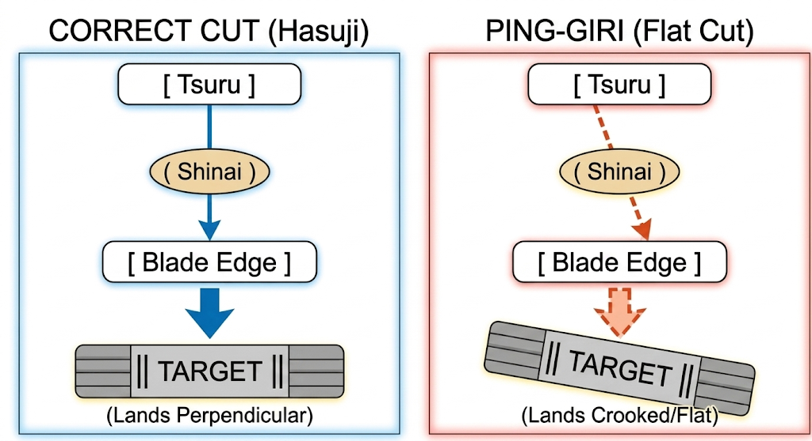
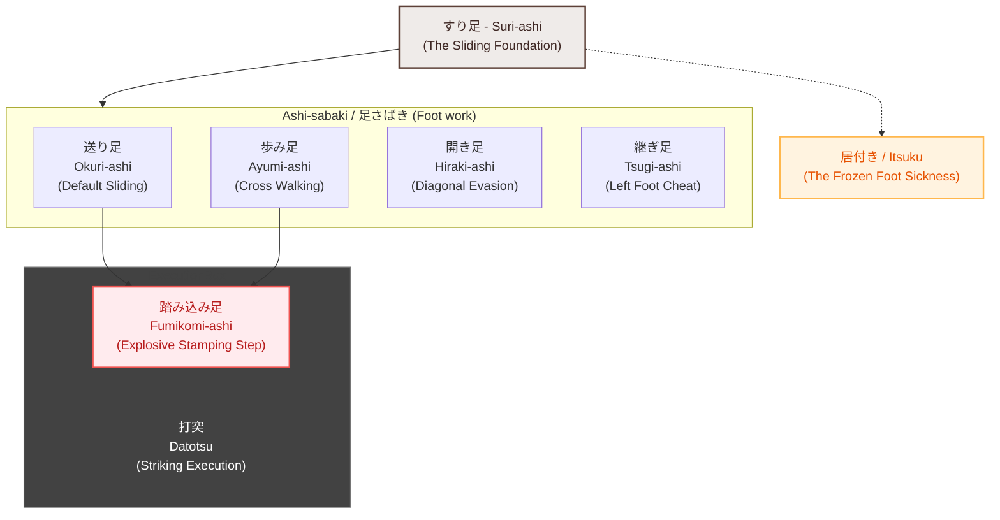
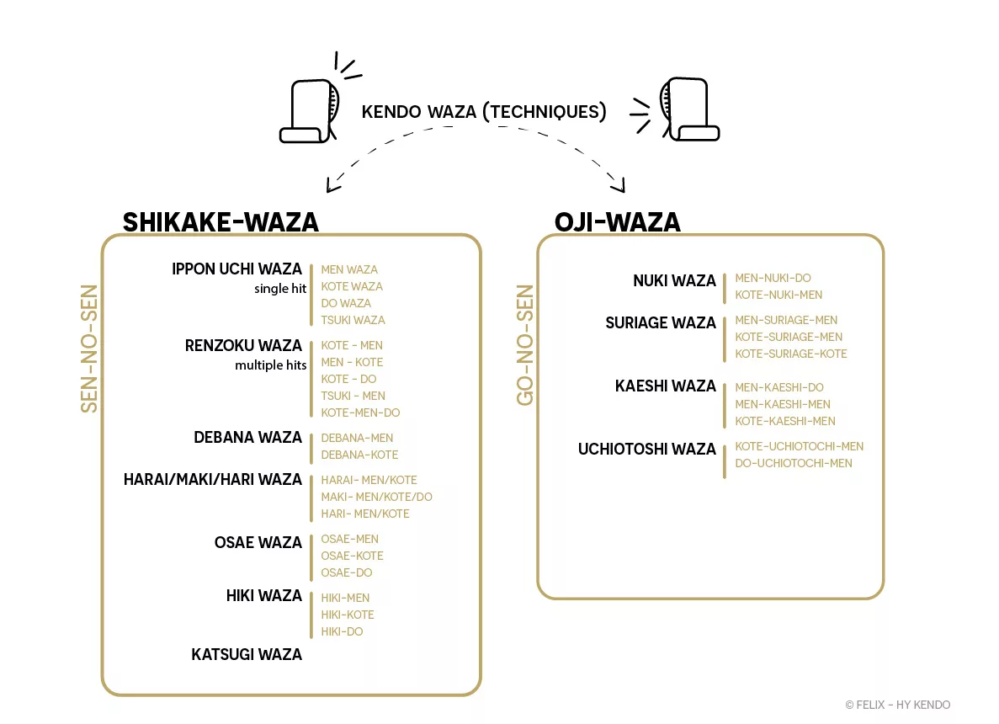

# Kendo waza repertorium

## Before you begin - Basics

### 攻め (せめ - Seme): Pressure / attacking spirit

Seme means "to attack" or "to apply pressure." It is the mental and physical aggression used to break the opponent’s spirit, destroy their kamae, and force them into a vulnerable position before you even execute a swing. Without seme, a strike is just a blind physical movement.

#### The Three Forms of Neutralizing/Supress (三殺法 - San Sappō)

To master seme, a practitioner must execute the three traditional methods of neutralizing an opponent:

1. 剣を殺す (けんをころす - Ken wo korosu): "Kill the sword" 
    
    *Meaning*: You actively suppress or dominate their physical weapon.
    
    **Application sample**: Using your kensen to slap, tap (張り - hari), push, or ride over their shinai. By physically taking away their center line, you render their weapon useless for defense or attack.

2. 技を殺す (わざをころす - Waza wo korosu): "Kill the technique"
    
    *Meaning*: You steal their opportunity to launch a viable attack.

    **Application sample**: Maintaining an aggressive, unpredictable rhythm so they cannot find a gap to start their movement. By smothering their physical setup, you ensure their intended technique dies before it can even leave their body.

3. 気を殺す (きをころす - Ki wo korosu): "Neutralize the Spirit"

    *Meaning*: You overwhelm and crush their mental resolve and confidence.
    
    **Application sample**: Projecting a fierce, unbreakable kiai and forward mental pressure (seme). When your spirit dominates theirs, the opponent paralyzes under the weight of the "Four Kendo Sicknesses" (Shikai): surprise, fear, doubt, and confusion

### 間合い (まあい - Maai): Distance / spacing

In Kendo, physical space is not static. It is a dynamic boundary that dictates safety, danger, and opportunity. Maai is divided into three exact tactical distances, measured by the crossover of the sword tips (kensen):

||||||
|---|---|---|---|---|
|[ Your Kamae ]|<========>|一足一刀の間合い|<========>|[ Opponent's Kamae ]|
|||(Crossed 10-15cm)|||

- 一足一刀の間合い (いっそくいっとうのまあい - Issoku Ittō no Maai): The "one-step, one-sword" distance. From here, you can strike the opponent by taking exactly one step forward, and you can evade their attack by taking exactly one step back. The kensen usually overlap by about 10 to 15 centimeters.

- 遠間 (とおま - Tōma): The long distance. The swords do not touch or cross. You are completely safe from a direct attack here, but you also cannot hit your opponent without taking multiple steps or executing an explosive leap.

- 近間 (ちかま - Chikama): The close distance. The swords cross deeply past the nakayui (leather tie). This is a highly dangerous zone. Both you and your opponent can strike each other instantly without taking a step forward.

### 先 (せん - Sen): Initiative / Timing

Sen is broken down into three distinct levels of initiative:

1. 先々の先 (せんせんのせん - Sensen no Sen): Pre-emptive initiative. You perceive the opponent's intent to attack before they even physically move, and you strike first, completely shattering their plan.

2. 先 (せん - Sen) / 対の先 (たいのせん - Tai no Sen): Simultaneous initiative. You and your opponent attack at the exact same moment, but your technique holds the center line and overpowers theirs (the core concept behind 出鼻技 / Debana Waza).

3. 後の先 (ごのせん - Go no Sen): Defensive initiative. You allow the opponent to strike first, but you masterfully evade, deflect, or block their attack and immediately land a counter-strike (the core concept behind 応じ技 / Ōji Waza).

### Combining 間合い (Maai) with 先々の先 (Sensen no Sen)

To execute 先々の先 (Sensen no Sen), you cannot wait in a passive distance. You must use Maai as a psychological trap to trigger and steal the opponent's initiative.

    STEP 1: Wait in Tōma (Safe Zone)
    STEP 2: Press forward into Issoku Ittō no Maai (Trigger Zone)
    STEP 3: Read the mind -> Strike instantly as their intent ignites

1. The Trap: Moving from Tōma to Issoku IttōYou start in Tōma, where both fighters are waiting. You then forcefully step forward into Issoku Ittō no Maai. By entering this strike zone, you project heavy 攻め (Seme - mental pressure). This sudden intrusion breaks the opponent's mental comfort zone.

2. The Trigger: Reading the ChaosWhen you cross that boundary, the opponent experiences a flash of panic or urgency. Their brain registers: "They are close enough to hit me, I must hit them first." 先々の先 (Sensen no Sen) happens right here. You do not wait for their muscles to move. You look at their eyes, their posture, and their breath to sense the exact millisecond their brain decides to attack.

3. The Execution: Stealing the MomentThe moment you feel their intent ignite, you launch your attack. Because you moved on their thought rather than their physical action, your body is already flying forward while their sword is still completely stationary. You occupy the center line, rendering their subsequent physical reaction completely useless.

### 構え (かまえ - Kamae): Stance / posture

Kamae translates to "stance," "posture," or "attitude."

In Kendo, it is not merely a physical position. It is a physical manifestation of your mental readiness. A correct kamae simultaneously protects your targets and threatens the opponent.

### Integrating the Four Pillars: 構え (Kamae), 間合い (Maai), 攻め (Seme), and Sen (先)

To understand high-level Kendo, these concepts must fuse into a single tactical sequence:

| Step | 1. Kamae (構え) | 2. Maai (間合い) | 3. Seme (攻め) | 4. Sen (先)|
|---|---|---|---|---|
|Action | Perfect Kamae | Advance Maai | Launch Seme | Seize Sen|
|Concept | Solid Stance | Enter Distance | Neutralize Spirit | Strike the Thought|

1. Maintain Kamae: You start in a flawless Chūdan no Kamae, showing zero openings.

1. Manipulate Maai: You move from Tōma into Issoku Ittō no Maai.

1. Project Seme: As you cross the distance, you target their mind (Kokoro wo korosu) by threatening their throat with your kensen.

1. Capture Sen: Your seme panics them. The exact moment their mind breaks and they decide to react, you seize 先々の先 (Sensen no Sen) and strike.

## Directions & Variations

- 表 (おもて - Omote): The left side of the blade (facing the opponent's left).

- 裏 (うら - Ura): The right side of the blade (facing the opponent's right).
払い落とし (はらいおとし - Harai-otoshi): Downward sweeping/slapping technique.

- 張り (はり - Hari): A quick tap or deflection.

## Body Mechanics & Mechanics

### 手の内 (てのうち - Tenouchi): Wrist snap / grip control.

Tenouchi refers to the coordinated squeeze, snap, and relaxation of the hands on the shinai handle (tsuka). It governs your ability to deliver a sharp strike without relying on brute arm strength.

The Grip Structure: 

1. The tsuka must be held primarily by the pinky and ring fingers of both hands, leaving the thumbs and index fingers relaxed. The left hand provides the power and acts as the axis, while the right hand guides the direction.
1. The Progressive Squeeze: At the exact millisecond of impact, you sharply squeeze both hands inward, mimicking the motion of "wringing a wet towel" (shiboru). The pinky and ring fingers lock down instantly.
1. The Rebound Control: Immediately after the squeeze, the hands instantly relax back to their baseline grip. This sudden tension-to-relaxation cycle creates the crisp, echoing snap (sae) necessary for a clean cut and stops the blade from vibrating or slipping.

### 鎬 (しのぎ - Shinogi): The side of the blade (ridge line).

The shinogi is the side ridge line of the blade. While a shinai is round, it mimics a real katana, which has flat sides. In Kendo, you almost never use the front cutting edge (hasuji) to block; you use the shinogi.

- *Shinogi-wo-kezurū (Scraping the Sides)*: When entering Issoku Ittō no Maai, you slide your shinogi against the opponent's shinogi. This constant physical contact acts as an early warning system, allowing you to feel their structural tension and movement before you can see it.

- *Deflection Over Blocking*: For defensive maneuvers, you tilt your shinai slightly to receive their strike on your shinogi, letting their blade slide off harmlessly. This keeps your center line secure, allowing you to instantly roll your sword over for a counter-attack.The Phrase 

- *"Shinogi-wo-kezuru"*: This Kendo term is so deep-rooted in Japanese culture that it became a common idiom in corporate and everyday Japanese, meaning "to engage in a fierce, neck-and-neck competition."

### 一本 (いっぽん - Ippon): A valid point / strike.

An Ippon is a decisive, valid point scored in a match. In Kendo, hitting the target is not enough. To achieve Ippon, your movement must demonstrate 気剣体一致 (きけんたいいっち - Ki-Ken-Tai-Ichi), meaning the synchronization of Mind, Sword, and Body.

A point is judged valid based on three strict criteria:Ki (The Spirit): 

1. Manifested through a powerful, loud, and confident kiai (shout) that names the target ("MEEEN!", "KOTEEE!") at the exact moment of the strike, showing full intent and zero hesitation.

1. Ken (The Sword): The strike must land squarely on a valid armor target using the correct part of the blade (物打ち - Monouchi) and with the correct cutting angle (刃筋 - Hasuji).

1. Tai (The Body): The body must deliver the strike with absolute posture, driven by a sharp, stamping step (踏み込み足 - Fumikomi-ashi).

1. 残心 (ざんしん - Zanshin): The physical and mental awareness after the strike. You must move past the opponent, turn around, and immediately raise your kamae, showing you are ready for a counter-attack. If you celebrate or drop your guard, the Ippon is canceled.

### 刃筋 (はすじ - Hasuji): Blade Alignment

Even though the shinai is round, you must swing it as if it possesses a sharp, flat steel edge like a katana.

*The Concept*: Hasuji refers to the angle and path of the cutting edge during a swing. The string (tsuru) on the back of your shinai represents the spine of the sword, meaning the exact opposite side is the cutting edge.

**Application sample**: When you strike Men or Kote, the cutting edge must hit completely perpendicular to the target. If your wrist turns or twists during the swing, the blade lands flat (called ping-giri or slapping), which immediately invalidates an Ippon.

Reference: https://sites.google.com/site/rakushinkan/blog/article-on-hasuji


source: google nano banana 2 (made with AI)

### 残心 (ざんしん - Zanshin): Lingering Awareness

Zanshin is the state of continuous mental and physical alertness that must exist before, during, and especially after an attack.

**The Concept**: Literally translated as "remaining mind," it means you do not relax after your sword strikes the armor. You assume the opponent is still a threat.

**Application sample**: After executing a Harai Men, you must sprint past the opponent, pivot around quickly (taitari), and snap back into Chūdan no Kamae with your kensen threatening their throat. If you drop your hands, celebrate, or look away, the referees will instantly take away your Ippon.

### 四戒 (しかい - Shikai): The Four Kendo Sicknesses

To successfully execute Ki wo korosu (Neutralizing the Spirit) during seme, you are actively trying to infect your opponent’s mind with the Shikai. Conversely, you must guard your own mind against them.

1. **驚 (きょう - Kyō / Surprise)**: Being caught off guard by an unexpected move, causing your physical mechanics to freeze.
1. **惧 (ぐ - Gu / Fear)**: Feeling intimidated by the opponent's size, rank, or aggressive kame, making you hesitate to move forward.
1. **疑 (ぎ - Gi / Doubt)**: Losing confidence in your own technique or overthinking the opponent's strategy, which destroys your reaction time.
1. **惑 (わく - Waku / Confusion)**: A state of mental chaos where your mind unfocuses, leaving you unable to make a clear tactical decision.

### 足さばき (あしさばき - Ashi-sabaki): Kendo Footwork

In Kendo, your feet are your true engine. They control your range (Maai), generate the power for your strike (Fumikomi), and maintain your balance after an attack (Zanshin).

Your hand grip control and wrist snap (手の内  - tenouchi) are completely useless without the underlying footwork framework. Power in Kendo travels from the floor upward through the core.



#### The Core Mechanic: すり足 (Suri-ashi)

It serves as the absolute baseline for all movements. By maintaining constant, skimming contact with the floorboards, you avoid the vulnerability of being airborne and weightless. It is the literal antidote to 居付き (Itsuki), the critical error of becoming frozen or rooted to the floor.

#### The Suri-ashi (すり足) Hierarchy

Lifting your feet creates a moment where you are airborne and weightless. If your opponent attacks while your foot is high in the air, you cannot change direction, evade, or push off to strike. Gliding flat across the floor ensures you are grounded and ready to react at any microsecond.

Here is the complete breakdown of all major categories of Ashi-sabaki:

- 送り足 (おくりあし - Okuri-ashi): The foundational sliding step. Your right foot is always in front, and your left foot follows instantly, maintaining a constant gap between your heels. You never cross your legs.

- 歩み足 (あゆみあし - Ayumi-ashi) / Walking Footwork: Normal walking steps where your feet alternate crossing past each other (left-right-left). This is used to cover large physical distances rapidly, typically when closing a wide 遠間 (Tōma) gap, sprinting past an opponent during Zanshin, or resetting posture quickly.

- 開き足 (ひらきあし - Hiraki-ashi) / Open-Step Footwork: Diagonal or lateral shifting where you step to the side while simultaneously swinging your body around to face the opponent. This is essential for evading a frontal charge and immediately executing counter-strikes (応じ技 - Ōji Waza).

- 継ぎ足 (つぎあし - Tsugi-ashi) / Step-in Footwork: A tactical movement where you secretly pull your left foot up closer to your right foot before launching an attack. This shortens your stance temporarily, giving you an explosive, unexpected burst of forward distance, though it temporarily leaves you vulnerable if caught mid-transition.

#### 踏み込み足 (Fumikomi-ashi): Strike Execution

*Fumikomi-ashi* functions as a **striking execution mechanic** rather than a method of locomotion. While advancing via *Okuri-ashi* or *Ayumi-ashi* to launch an attack, your leading foot skims fractions of a millimeter above the floorboards, adhering strictly to low-profile *Suri-ashi* physics. At the terminal millisecond of the strike, you abruptly convert that forward locomotion into downward acceleration by driving your right foot into an explosive stamp. This decisive impact registers the physical **"Tai" (Body)** component required to satisfy **気剣体一致 (Ki-Ken-Tai-Ichi)**.


#### 居付き / 居付く (Itsuki / Itsuku): To become frozen, rooted, or stuck to the floor

If you abandon Suri-ashi—by settling heavily onto your heels or allowing your left knee to drop its spring-like tension—you fall into the footwork sickness called Itsuku. 

This happens when your weight settles heavily onto your heels, or when your left knee loses tension. Your feet become "glued" to the ground. When you are caught in a state of Itsuku, your reaction time drops to zero, making you an incredibly easy target for your opponent's 仕掛け技 (Shikake Waza).

#### The Left Leg Engine: Driving Okuri-ashi and Fumikomi

To maximize the speed and power of your movement, your left leg must act as a coiled spring. The mechanics rely entirely on the tension of your left leg tendons and posture:

    [ Left Heel Flat ] ──> Slack / Slow / No Tension (Incorrect)
    [ Left Heel Up ]   ──> Coiled Spring / Constant Tension (Correct)

- *The Anchor (ひかがみ - Hikagami)*: The back of your left knee (hikagami) must be kept straight and locked in tension, never bent or soft.
- *Heel Elevation*: Your left heel must never touch the floor. Keep it elevated about 1 to 2 centimeters (the thickness of a piece of cardboard). This constantly pre-loads your Achilles tendon.
- *The Trigger*: When you decide to move or strike via 先 (Sen), your left foot does not push forward; it pushes downward and backward into the floor. This action instantly launches your entire torso forward from your hips.
- *The Recovery*: The moment your right foot lands or stomps (踏み込み足 - Fumikomi-ashi), your left foot must snap forward instantly like a rubber band. If your left foot drags or lags behind, you lose your posture, killing your balance and spoiling any chance of a valid Ippon.

### 体さばき (たいさばき - Tai-sabaki): Body Displacement / Orientation

While *Ashi-sabaki* governs the management and placement of the feet, **体さばき (たいさばき - Tai-sabaki)** refers to the dynamic displacement and reorientation of the entire torso. It is the mechanic used to evade incoming attacks, absorb physical impact, and instantly create superior striking angles relative to the opponent's centerline.

#### 1. Core Displacement Mechanisms
-   **転換 (てんかん - Tenkan) / Pivoting:** Swiveling the hips and torso on a sharp central axis, typically initiated by a step from *Hiraki-ashi*. This action rotates your body completely out of the path of a frontal attack while keeping your *kensen* tracking the opponent.
-   **身体の転向 (しんたいのてんこう - Shintai no Tenkō) / Body Reorientation:** Changing the physical direction your chest is facing without moving your spatial position. This is critical when an opponent rushes past you, allowing you to snap your posture around to face them instantly during *Zanshin*.

#### 2. Close-Quarters Mechanics
-   **体当たり (たいあたり - Taitari) / Body Collision:** The tactical execution of physical contact at close range (*Chikama - 近間　-　ちかま*). When crashing into an opponent, you leverage a perfectly vertical spine, locked hips, and a compressed core to absorb, deflect, or displace their mass. Maintaining flawless *Tai-sabaki* during a collision prevents your center of gravity from breaking, allowing an immediate transition into **連続技 (Renzoku Waza)**.


## 技 (わざ - Waza): Techniques



source: https://hy-kendo.com/2024/10/19/understanding-shikake-waza-and-oji-waza-in-kendo-strategies-for-beginners/

### 仕掛け技 (しかけわざ - Shikake Waza): Offensive/initiating techniques

Offensive techniques where you initiate the attack to break the opponent's posture or create an opening.

From Helsinki University Kendo Club:

    Shikake-waza (仕掛け技) are proactive techniques where you take the initiative, disrupting your opponent’s balance to create an opening for a strike. These techniques teach you how to control the flow of a match by applying constant pressure, known as seme (攻め), which forces the opponent into a reactive position (whether that reaction is defense, or a strike).

#### 一本打ち技 (いっぽんうちわざ - ippon uchi waza)

In the technical hierarchy of Kendo, 一本打ち技 (Ippon Uchi Waza) represents the most fundamental classification within 仕掛け技 (Shikake Waza - Offensive Techniques) [AJKF]. It is the execution of a single, decisive, and fully committed strike directed at a single target (Men, Kote, Dō, or Tsuki) from the baseline distance of 一足一刀の間合い (Issoku Ittō no Maai).

Ippon Uchi Waza leaves absolutely no room for hesitation, calculation, or a secondary backup plan. It is the purest physical manifestation of 捨て身 (すてみ - Sutemi)—the total abandonment of self-preservation to deliver a definitive blow.

##### The Core Principle: Seme-to-Strike Fluidity

An authentic Ippon Uchi Waza is never a random, hopeful swing. It is a calculated explosion triggered by the manipulation of space and spirit.

    [ Solid Chūdan ] ───> [ Break Center Line ] ───> [ Single Explosion ]
    (Kamae Stance)         (Seme/Pressure)           (Ippon Uchi Waza)

1. **Preparation**: You maintain a flawless 中段の構え (ちゅうだんのかまえ - Chūdan no Kamae), showing no physical openings.
1. **The Trigger (Seme)**: You step forward, using your kensen to execute 剣を殺す (けんをころす - Ken wo korosu)—manipulating or displacing their blade to seize the center line.
1. **The Launch**: The exact millisecond your seme breaks their posture or mental resolve (気を殺す - Ki wo korosu), you capture 先々の先 (Sensen no Sen). You do not wind up; your hips drive your body forward instantly.
1. **The Impact**: Your hands execute crisp 手の内 (Tenouchi) with absolute 刃筋 (Hasuji - Blade Alignment) at the exact microsecond your right foot stamps the floor boards (踏み込み足 - Fumikomi-ashi).

Ippon Uchi Waza is categorized by its intended target armor component:

1. **面打ち (めんうち - Men-Uchi) / Center Head Strike**
    
    The most used strike in Kendo. Driven by the explosive launch of the left leg, the sword travels in a straight, vertical arc along the centerline. The hands snap forward using Tenouchi to land the monouchi flat and true onto the top of the opponent's men.

1. **小手打ち (こてうち - Kote-Uchi) / Right Wrist Strike**

    A compact, fast strike targeting the opponent's right forearm pad. Because the target is lower and closer than the head, the vertical arc of the sword is smaller and relies heavily on sharp wrist acceleration (Tenouchi) to snap the blade downward onto the wrist the moment their hands lift even slightly.

1. **胴打ち (どううち - Dō-Uchi) / Right Torso Strike**

    A diagonal cutting technique targeting the right side of the opponent's torso protector. As you step forward, your hands angle the hasuji to strike diagonally across the torso. Flawless 体さばき (Tai-sabaki) is required to clear your body safely past their left side immediately after impact.

1. **突き (つき - Tsuki) / Throat Thrust**

    A highly advanced, linear thrust directed precisely at the throat protector (Tsuki-dare). This requires absolute core stability and alignment; you lock your arms and drive your entire body mass forward through the kensen, piercing the center line with zero lateral deviation.

In shiai, many single strikes fail to score because they lack the strict requirements of 気剣体一致 (Ki-Ken-Tai-Ichi). The most common technical failures include:

- Flat Slapping (Hirauchi / Ping-giri): The round shinai twists in the palm right before impact, causing the side of the blade (shinogi) to hit the armor instead of the cutting edge (hasuji).

- Dragging the Anchor: The right foot steps forward or stamps (Fumikomi), but the left foot lags behind on the floor. This breaks your vertical posture, instantly invalidating the "Tai" (Body) element of the point.

- Absent Zanshin: The practitioner drops their hands or celebrates after hitting the armor. Without snapping immediately back into a defensive, threatening Chūdan stance to face the opponent, the Ippon is automatically canceled.

#### 連続技 (れんぞくわざ - Renzoku Waza): continuous, combination techniques

Within the framework of 仕掛け技 (Shikake Waza - Offensive Techniques), 連続技 (Renzoku Waza) represents the execution of multiple, fluidly chained strikes aimed at systematically dismantling an opponent's defense [AJKF].

A critical misconception is that the initial strike in a combination is merely a fake or a soft feint. In authentic Kendo, every single strike within a combination must be executed with absolute, fully committed intent (捨て身 - Sutemi) to score. You must make a definitive decision to pierce the target with each movement; a faint or half-hearted attempt lacks genuine 攻め (Seme) and will fail to provoke the defensive reaction required to open up the next target.

If the first strike lands cleanly, it scores as a valid 一本 (Ippon). If the opponent manages to block your initial, fully committed assault, their defensive movement is what dynamically creates the physical opening for your secondary or tertiary strikes.

The defining characteristic of true Renzoku Waza is the total absence of a mental or physical pause between these decisions. It is not a sequence of separate actions performed back-to-back, but continuous, unified breath and multi-stage decision pattern.

To execute combination techniques effectively, your mental conviction and body mechanics must function as a rapid, cycling engine.

    [ Fully Committed 1st Strike ] ───> [ Instant Left-Foot Snap ] ───> [ Fully Committed 2nd Strike ]
    (Decide to Score / Hit Target)        (Maintain Forward Core)         (Exploit Opening / Hit Target)

1. **The Primary Strike**: You launch a fully committed attack toward the first target with the absolute decision to score. Because this strike carries genuine power and spirit, the opponent is forced to execute a reactive block or evasion.

1. **The Left Foot Engine**: The moment your right foot makes contact with the floor on the first strike, your left foot must snap forward (Okuri-ashi) with lightning speed to support your weight. If your left foot drags, your posture collapses, your forward momentum dies, and you fall into the footwork sickness of 居付き (Itsuki)—rendering your decision to launch a second strike physically impossible.

1. **The Immediate Re-launch**: You do not wind up or reset your hands back to your center Chūdan position. Instead, you use the crisp rebound energy from the first impact, utilizing sharp 手の内 (Tenouchi) to immediately launch your next fully committed strike into the newly exposed target.

- **二段技 (Ni-dan waza)**: A two-step combination (e.g., Kote-Men or Kote-Dō).

- **三段技 (San-dan waza)**: A three-step combination (e.g., Kote-Men-Dō).

#### 出鼻技 (でばなわざ - Debana Waza): timing-based, anticipatory techniques

Even though Debana feels like a counter-attack because the opponent is moving, it is considered Shikake because your forward mental pressure (seme) is what forcefully provoked them into launching that predictable attack in the first place.

The word Debana translates literally to "the very moment of emergence" or "the snout of the movement".

Rather than striking an opponent who is standing still, or attacking in combinations after they block, Debana Waza is the execution of a lightning-fast strike at the precise millisecond your opponent decides to launch their own attack, catching them when they are completely committed to forward motion but before their blade can descend.

1. **出鼻面 (でばなめん - Debana-Men) / Head Strike at the Onset**

    Executed when the opponent attempts to launch a Men strike under pressure. The moment they break their own 中段の構え (Chūdan no Kamae) and lift their hands to swing, their centerline is completely exposed. You drive straight forward along the absolute center, your blade slicing downward to land perfectly true on their head pad (Men) while their sword is still stuck at the apex of its upward swing.

1. **出鼻小手 (でばなこて - Debana-Kote) / Wrist Strike at the Onset**

    Executed when the opponent lifts their hands high to strike your head. As their arms rise, their right wrist (Kote) moves upward and forward, creating a highly visible, static target. You execute a compact, downward wrist snap using sharp 手の内 (Tenouchi) to catch the underside or side of their right wrist padding the exact instant their hands reach their highest point.

#### 払い技 (はらいわざ - Harai waza): Sweeping techniques

払い技 (Harai Waza) is a dynamic class of techniques designed to forcefully dismantle an opponent's physical posture (構え - Kamae) [AJKF]. This method is deployed when an opponent maintains a highly rigid, defensive, or stubborn centerline that cannot be breached by mental pressure (攻め - Seme) alone.

By executing a sharp, percussive sweep or slap against the opponent's shinai, you physically displace their weapon from the centerline. This sudden structural failure creates an immediate, unguardable opening, allowing you to deliver an instantaneous strike to an exposed target in a single, unbroken motion.

A technically flawed Harai Waza is often executed as two separate actions (slap, then swing). A valid point (一本 - Ippon), however, demands that the sweep and the strike fuse into a single, seamless kinetic chain.

    [ Sharp Tenouchi Sweep ] ───(Continuous Momentum)───> [ Instant Stamping Cut ]
     (Displace Enemy Shinai)                                 (Fumikomi-ashi Target)

1. **The Contact Point**: You step forward into 一足一刀の間合い (Issoku Ittō no Maai). Your sweep must target the top third of the opponent's blade, just below their kensen. Hitting too close to their handguard (つば - Tsuba) will not move their sword; hitting the very tip allows their blade to spring back too quickly.
1. **The Wrist Snap**: You use the side ridge line (鎬 - Shinogi) of your blade to strike theirs. The power does not come from swinging your arms, but from a compact, inward rotation of the wrists (手の内 - Tenouchi).
1. **The Continuous Arc**: The moment your blade deflects their shinai, you do not stop or pull your sword back. You leverage the upward or lateral momentum of the deflection to immediately carry your blade straight into the target area.
1. **The Termination**: The strike must land with perfect blade alignment (刃筋 - Hasuji) at the exact millisecond your right foot stomps the floorboards (踏み込み足 - Fumikomi-ashi).

#### Core Tactical Classifications

The fundamental variation for clearing the centerline.

-   **Omote (表) Variation:** From *Chūdan*, you execute a sharp, diagonal downward or lateral slap from your right to left against the opponent's blade. This knocks their *shinai* outward to **their right (your left)**, exposing the top of their head for a direct, vertical *Men* cut.

-   **Ura (裏) Variation (Most Common in Shiai):** You cross your blade over to slap their *shinai* from your left to your right. This drives their sword outward to **their left (your right)**. Because this strike hits in the direction of their open fingers on the *tsuka* handle, it easily forces their grip to fail, creating a massive, chaotic opening for an immediate *Men* strike.

```
                   CHUDAN-NO-KAMAE (Neutral Centerline)
                   ====================================
                   
                           [ Opponent's Body ]
                           /                 \
        (Opponent's Left / Kote Side)     (Opponent's Right / Chest Side)
                                  \         /
                                   \       /
                                    \     /
                                     \   /
                                      \ /
                            [ Opponent's Shinai ]
                                      |
                                      |
  ====================================X====================================
  URA SIDE (Your Right)               |               OMOTE SIDE (Your Left)
  --------------------                |               ----------------------
  * Contact on RIGHT side of shinai   |   * Contact on LEFT side of shinai
  * Matches opponent's Kote side      |   * Default starting position
                                      |
                            [ Your Own Shinai ]
                                      |
                                      |
                                      ^
                                  [ You ]
```

Harai Waza is categorized by the direction of the sweep — 表 (おもて - your left side, facing the opponent's right/chest side), or 裏 (うら - your right side, facing the opponent's left/kote side) — and its corresponding target:

- 払い面 (はらいめん - Harai Men): Sweeping strike to the head
    
    The fundamental variation for clearing the centerline.
    -   **Omote Sweep:** A sharp, percussive slap from your right to left, knocking their *shinai* outward to *their* left (your right) to clear a path for a vertical *Men* cut.
    -   **Ura Sweep:** A crossover slap from your left to right, driving their sword to *their* left (your right). This attacks the open side of their grip, making it highly effective in *shiai* for destabilizing their balance before the *Men* strike.


    References: 
    - [Kendo and Iaido Concepts: Omote vs. Ura](https://www.youtube.com/watch?v=Wfq7QRzZMLs&t=4s)
    - [Pressuring Ura and Omote (Imazato Manabu)](https://kendojidai.com/2024/08/05/pressuring-ura-and-omote-imazato-manabu/)

- 払い小手 (はらいこて - Harai Kote): Sweeping strike to the right wrist. 

    A precision technique used to expose the right forearm padding. You typically execute a sharp **Ura sweep** to slap the opponent's blade upward or outward to your right. This lateral displacement removes their protection and completely isolates their right wrist, allowing you to instantly snap your hands down onto the *Kote* target.

    This variation targets the wrist by destabilizing the opponent's guard. Because the Kote is located on the opponent’s right side (your left), Ura execution is the most common and tactically efficient setup for this target.
    
    - **Omote Sweep** (Less Common for Kote):
        - Execution: From Chūdan, execute a sharp snap from your right to left against the left side of their blade.
        - Result: This knocks their shinai outward to their right (your left).
        - Tactical Follow-up: Because their blade is pushed away from their Kote, you must slice diagonally across the centerline to catch their wrist. This is often used as a feint—making them think Men is coming so they lift their hands, exposing the wrist underneath.

    - **Ura Sweep** (Highly Effective Shiai Setup):
        - Execution: Cross your blade over to the right side of their blade and execute a sharp snap from your left to right.
        - Result: This drives their shinai outward to their left (your right).
        - Tactical Follow-up: This mechanical push knocks their sword directly away from their Kote side while collapsing their grip leverage. Your shinai lands perfectly in the center of their body, allowing you to drop straight down into an instantaneous, compact Kote strike with zero wasted movement.

    Use it when the opponent has a soft and flexible kamae.
    
    References:
    - [Tip of the week: haraigote](https://www.youtube.com/shorts/ukQT4m2d4HQ)
    - [Pressuring Ura and Omote (Komeda Toshiro)](https://kendojidai.com/2024/07/15/pressuring-ura-and-omote-komeda-toshiro/)

- 払い胴 (はらいどう - Harai Dō): Sweeping strike to the torso.

    A specialized technique deployed against opponents who rigidly guard their upper targets (raises their shinai too often). You execute a sharp, upward sweeping motion (**払い上げ - Harai-age**) from the *Omote* side to fling their blade up and away from their center. As their hands chase the deflection upward, their right flank is completely exposed. You immediately drop your center of gravity, realign your *hasuji*, and cut diagonally through the right ribcage (*Dō*).

    This variation clears the centerline to expose the torso. It is highly effective against opponents who hold a very stiff, rigid kamae or those who heavily track and block your Men attempts.

    - **Omote Sweep** (Standard Gyaku-Do Setup):
        - Execution: Execute a sharp snap from your right to left against the left side of their blade.
        - Result: This knocks their shinai outward to their right (your left).
        - Tactical Follow-up: Pushing their blade to your left exposes the left side of their torso. You immediately transition the momentum of the sweep into a diagonal, descending strike to their Gyaku-Do (reverse/left torso).
    - **Ura Sweep** (Standard Migi-Do Setup):
        - Execution: Cross your blade over to the right side of their blade and execute a sharp snap from your left to right.
        - Result: This drives their shinai outward to their left (your right).
        - Tactical Follow-up: This forces their blade far to your right. Because their hands are driven wide, the path to their Migi-Do (standard/right torso) is completely unguarded. You drop your hands slightly and slice cleanly through the right side of their ribcage.


#### 巻き (まきわざ - Maki waza): Spiraling

#### 張り技 (はりわざ - Hari waza):

#### 押さえ技 (おさえわざ - Osae waza)

#### 引き技 (ひきわざ - Hiki waza)

#### 担ぎ技 (かつぎわざ - Katsugi waza)

### 応じ技 (おうじわざ - Ōji Waza)

Counter-attacking techniques where you wait for the opponent to strike first, then block, deflect, or evade and strike back.

#### 擦り上げ技 (すりあげわざ - Suriage Waza)


## References

- [[WAZA STUDY] - 8 Ways to Make a Successful MEN Strike!](https://youtu.be/YsAV3rx_UEE?si=hR9Pxqkg-9AWuv5N)

- [Understanding Shikake-Waza and Oji-Waza in Kendo: Strategies for Beginners](https://hy-kendo.com/2024/10/19/understanding-shikake-waza-and-oji-waza-in-kendo-strategies-for-beginners/)
    - https://web.archive.org/web/20260115182821/https://hy-kendo.com/2024/10/19/understanding-shikake-waza-and-oji-waza-in-kendo-strategies-for-beginners/
- [Hasuji](https://sites.google.com/site/rakushinkan/blog/article-on-hasuji)
    - https://web.archive.org/web/20250616013831/https://sites.google.com/site/rakushinkan/blog/article-on-hasuji
- [Kendo and Iaido Concepts: Omote vs. Ura](https://www.youtube.com/watch?v=Wfq7QRzZMLs&t=4s)
- [Pressuring Ura and Omote (Imazato Manabu)](https://kendojidai.com/2024/08/05/pressuring-ura-and-omote-imazato-manabu/)
- [Kendo Techniques Guide](https://www.kendo-guide.com/kendo_techniques.html)
- [Pressuring Ura and Omote (Komeda Toshiro)](https://kendojidai.com/2024/07/15/pressuring-ura-and-omote-komeda-toshiro/)